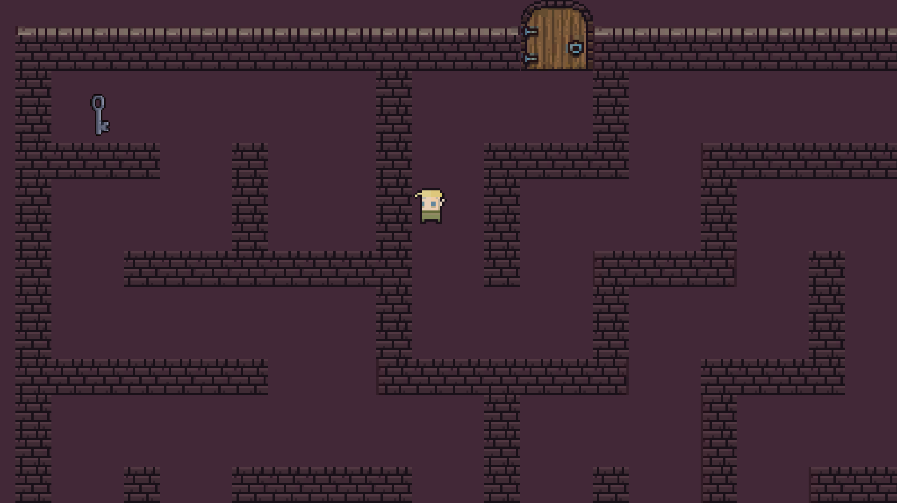
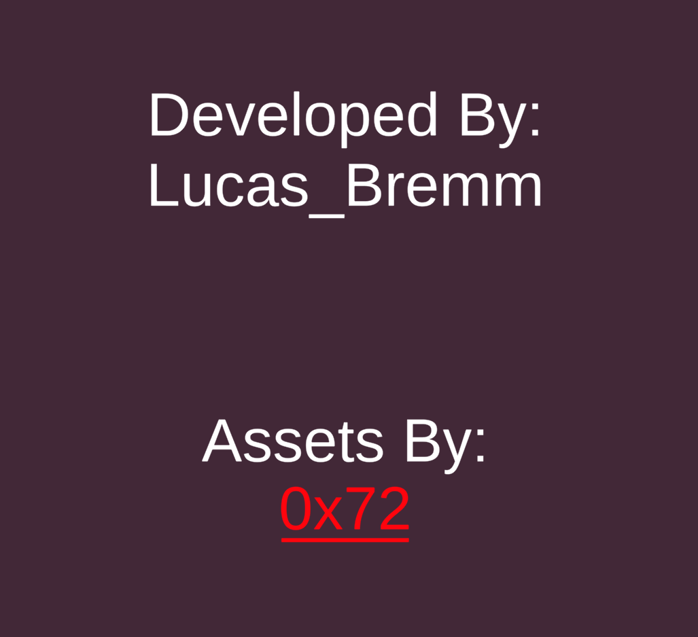

# Maze 0x72

This is a Unity game made to practice game development. I intend to increment it a little bit more, with enemies and things like that.

Special thanks to [0x72](https://0x72.itch.io/) for the assets used to make this game.

The game can be played on [Itch](https://lucas-bremm.itch.io/maze-0x72), where I published it in my account.

